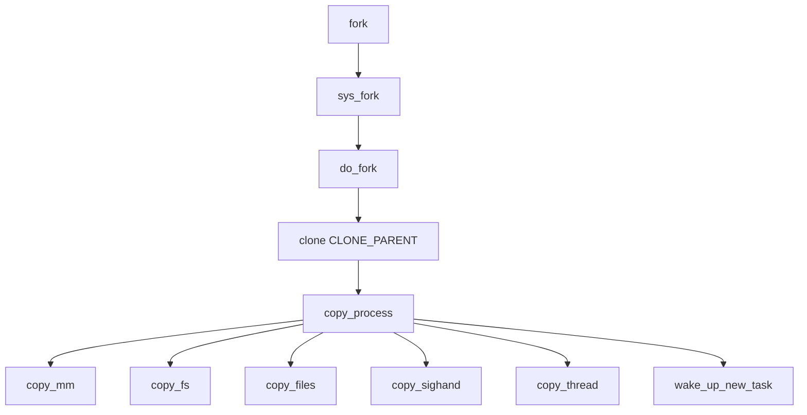

<!--more-->


## 线程和进程的创建过程

看到这个标题的第一反应你的想法是什么呢, 是不是觉得在Linux中线程和进程的创建流程可以会有很大的不一样, 实际上, 从内核的视角来看, 线程和进程的创建基本是一样的, 都是调用`clone`系统调用, 只不过传递的参数不一样而已, 下面我们就来分析一下`clone`系统调用的过程.

### clone系统调用

`clone`系统调用是Linux中创建线程和进程的底层实现, 它的函数原型如下:

```c
long clone(int (*fn)(void *), void *child_stack, int flags, void *arg, pid_t *ptid, struct user_desc *tls, pid_t *ctid);
```

`clone`系统调用的参数如下:

- `fn`: 子进程/线程的入口函数
- `child_stack`: 子进程/线程的栈空间
- `flags`: 创建进程/线程的标志
- `arg`: 传递给子进程/线程的参数
- `ptid`: 父进程/线程的线程ID
- `tls`: 线程局部存储
- `ctid`: 子进程/线程的线程ID

`clone`系统调用的返回值如下:

- 成功: 返回子进程/线程的线程ID


